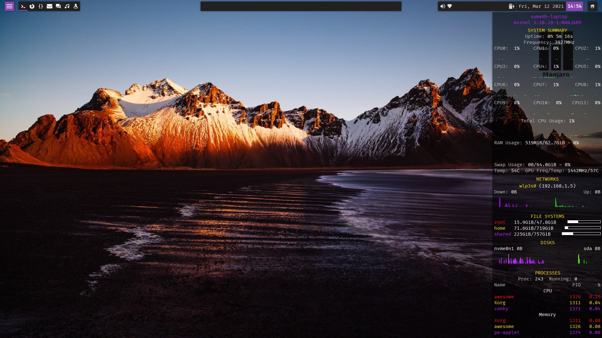
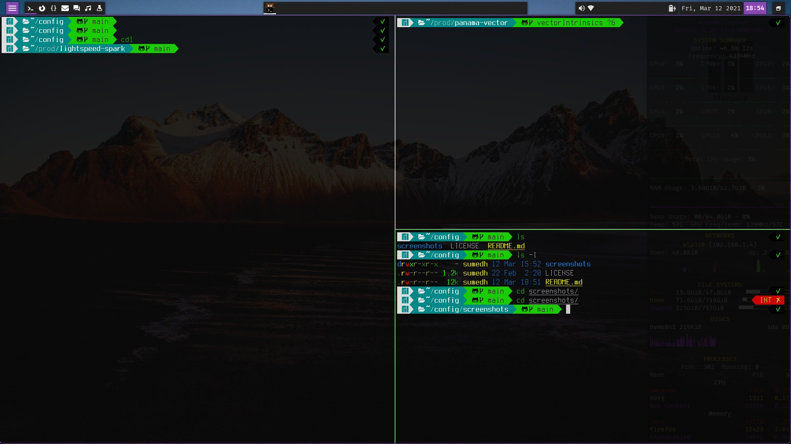
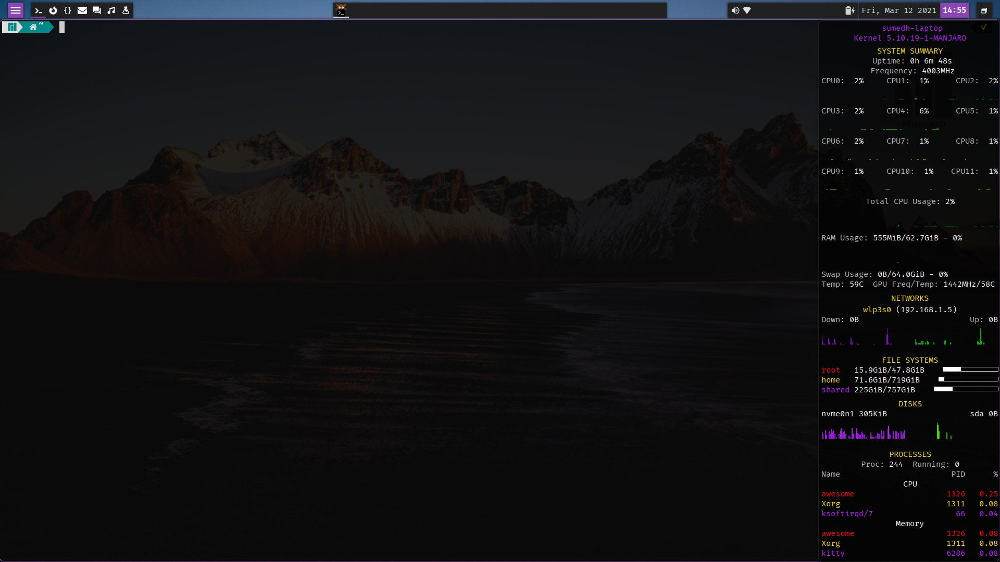
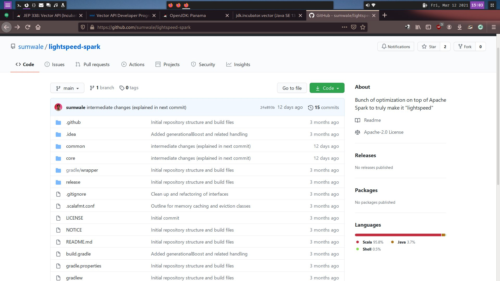
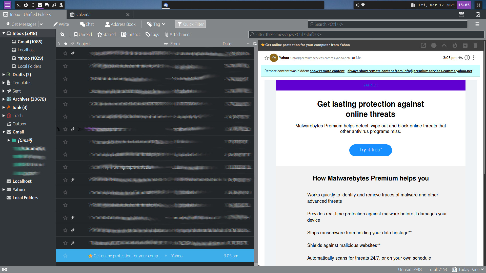
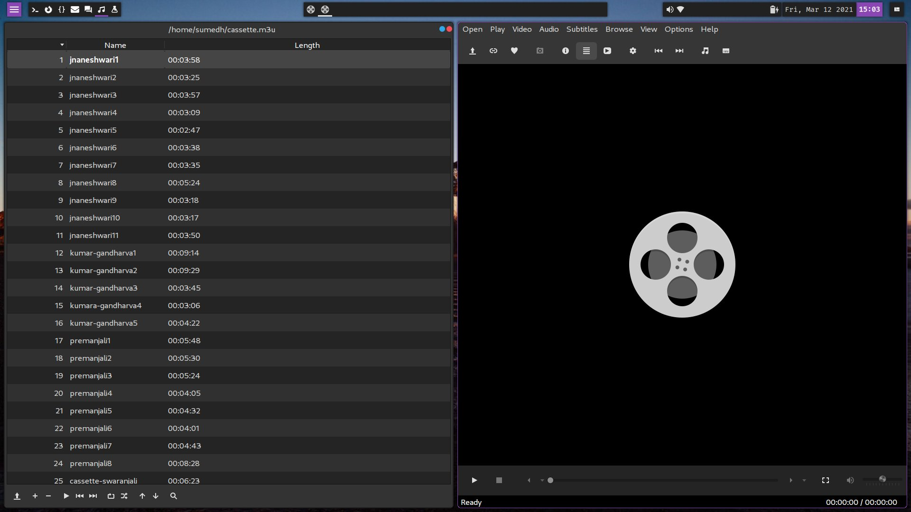

This is the set of current configuration files on my Manjaro Linux installation including those for awesome, conky, kitty, neovim, borgmatic backup, custom scripts, customized themes among others. Some of these are specific to my hardware so cannot be used without modifications on other systems.

Some of the specific customizations include:

* .zshrc, .bashrc use PATH and aliases specific to data and require manjaro-zsh-config to work as expected
* .Xresources, .xsettingsd use 120dpi and whitesur-purple-dark theme with tela-circle-purple-dark icons
* .gitconfig obviously contains my information in the [user] section and requires git-credential-libsecret to be installed (Arch package has it while for others it may need to be built e.g. ubunu/debian have the source in /usr/share/doc/git/contrib)
* .asound.state is specific to my soundcard configuration and is restored on startup overriding any changes that pulseaudio may have done
* borgmatic backup configuration is specific to my borgbase account and uses secret-tool to obtain password
* conky configuration uses:
  * CPU count of 12 (from /proc/cpuinfo which includes hyper-threading) is specific to my hardware so change the count/layout as per your setup
  * network devices named enp2s0 and wlp3s0 that may need to be changed
  * disk devices nvme0n1, sda, sdb are also specific to my hardware
  * nitrogen with random wallpaper picked from ~/Pictures/wallpapers
  * update-notifier.sh script in .local/bin for awesome wm which assumes ARCH based system having pamac and dunstify installed
  * touchpad-settings.sh in .local/bin to setup touchpad
  * user-services.sh in .local/bin that invokes the borgmatic service timer to ensure that backup is never missed and loads .asound.state
* awesome wm configuration has many machine specific customizations noted in the next section


## Awesome configuration

A unique aspect of this awesome configuration is a well working conky setup which is otherwise tough to get working with tiling window managers. The configuration was originally based off https://github.com/Purhan/dotfiles redhound look, and some customizations from https://github.com/ChrisTitusTech/titus-awesome. There are a large number of changes on the original redhound look though overall layout is retained. It also uses the Alt-tab switcher from https://github.com/berlam/awesome-switcher.

### Screenshots

After login (first tag uses floating layout)

<p align="center">
  
</p>

Kitty terminal

<p align="center">
  
</p>

Kitty with conky in foreground using Super-c

<p align="center">
  
</p>

Firefox in second tag having max layout (Ergodark theme)

<p align="center">
  
</p>

Thunderbird in fourth tag having max layout (Moterail Full Dark extension with light theme)

<p align="center">
  
</p>

SMplayer in sixth tag having tiled layout

<p align="center">
  
</p>

### Setup

The layout works is designed for a 1920x1080 screen and uses 120dpi with base font size of 10pt that looks the best overall on my laptop and desktop. I will suggest starting with this setup and adjusting later if you would rather prefer default 96dpi with 11/12pt fonts  or something else. Note that with default 96dpi some apps and GUI elements use their own font sizes ignoring the GTK/X configuration and may look too small.

Changing dpi/fonts requires changing .Xresources, .xsettingsd (or use lxappearance), awesome and kitty configuration files.

* Copy the following directories from .config to your ~/.config: awesome, rofi, gimplecal, conky and kitty (skip latter three if you don't intend to use those). Optionally Kvantum for Kvantum QT theme.
* Copy .themes/WhiteSur-Dark-purple to your ~/.themes. Skip if you intend to use some other GTK theme.
* Copy .Xresources and .xsettingsd to your home. If you don't use GNOME, then you can use lxappearance to configure instead. For that case avoid kvantum for QT apps and instead use qt5ct to configure look-and-feel for QT apps with QT\_QPA\_PLATFORMTHEME as qt5ct or use gtk2 for the QT\_QPA\_PLATFORMTHEME.

#### Required

  * awesome, rofi, picom
  * gsimplecal for calendar popup (if not present, then change .config/awesome/layout/date-panel.lua with equivalent app or comment out connect\_signal for panel/backdrop + uncomment the month\_calendar popup in that file); update .config/gsimplecal/config as per your requirements especially the timezones listed at the end for which additional clocks are shown in the widget
  * xsettingsd or lxappearance. If you use GNOME too, then former is recommended where you can dump your settings using "dump\_xsettings | sort | grep -iv session > ~/.xsettingsd". Else run lxappearance and choose your preferred theme/icons/cursor etc.
  * Arch: pamac-gtk or yay/AUR helper you prefer. On other distros, the appropriate package manager.
  * kvantum-qt5 and either qgnomeplatform or qt5ct for QT apps. Alternatively you can use qt5-styleplugins and use gtk2 as the QT style.

I also occasionally use GNOME desktop so my GTK layout has been done there with gnome-tweaks and so this configuration uses xsettingsd to share the same configuration for GTK/QT apps. Alternatively if one doesn't use GNOME at all, one can use lxappearance to set the themes/icons/cursor.

For Qt apps, kvantum is being used as the QT style, with WhiteSur-dark as the theme. Unfortunately there is no purple variant there but it doesn't matter to me since very few QT apps are being used. Either set the following:

```
export QT_AUTO_SCREEN_SCALE_FACTOR=1
export QT_QPA_PLATFORMTHEME=gnome
export QT_STYLE_OVERRIDE=kvantum
```

or

```
export QT_QPA_PLATFORMTHEME=qt5ct
```
and run qt5ct to choose kvantum as the theme.

For both cases run kvantummanager and choose the WhiteSur-Dark theme or whichever you prefer.

Alternatively you can use the gtk2 theme for QT apps by installing qt5-styleplugins and:

```
export QT_QPA_PLATFORMTHEME=gtk2
```

Either add these to your .profile or remove "export" and add to /etc/environment or ~/.pam\_environment

#### Recommended

 * whitesur for gtk/qt, tela-circle for icons, vimix-cursors or whitesur for cursor theme. Specifically use the dark-purple version in the .themes which matches the colors used in awesome. On Arch: pamac install whitesur-gtk-theme-git whitesur-kvantum-theme-git vimix-cursors tela-circle-icon-theme-git (or yay/... whatever AUR helper you use). On other distros you may need to install the themes from gnome-look to your home directory manually (whitesur-gtk can be skipped if you use the WhiteSur-Dark-purple from .themes).
 * polkit-gnome/policykit-1-gnome, gnome-keyring -- for keyring with ssh/gpg agent support
 * xset from xorg-xset, rfkill from util-linux
 * conky -- note that floating layout is required for this to work acceptably which is setup in this awesome configuration for the first tag. Use conky-lua-nv if you have NVIDIA card.
 * nitrogen for wallpaper which is invoked by conky at interval of 1 day to choose a random wallpaper from ~/Pictures/wallpapers so you can place all your wallpapers there. Alternatively one can use feh+variety or similar which will need appropriate changes to configuration/apps.lua and conky.conf
 * the following custom scripts from .local/bin: airplane-toggle.sh, volume-change.sh
 * notify-send to display notifications (libnotify in Arch)
 * canberra-gtk-play for alert sounds (libcanberra in Arch)
 * pulseaudio and alsa-utils for sound related shortcuts
 * i3lock-fancy (package i3lock-fancy-git in Arch) for screen locking, with scrot and imagemagick
 * Arch: pamac-gtk, dunstify for update-notifier.sh script launched by conky periodically; see more in conky subsection
 * Fonts: cantarell, fira-code, terminus-ttf. On Arch: pamac install cantarell-fonts ttf-fira-code terminus-font-ttf. If you prefer some others then change awesome, conky, .xsettingsd and kitty configurations
 * nm-applet for network management
 * xfce4-power-manager, xss-lock for power management and screen locking. Can be skipped if the system is not a laptop. My /etc/systemd/logind.conf has HandleLidSwitch and HandleLidSwitchExternalPower set to lock.
 * xbacklight for brightness control, xinput for touchpad settings

On Arch use this to get the required and recommended packages:

pacman -S pamac-gtk

pamac install awesome rofi picom gsimplecal procps lxappearance xsettingsd pulseaudio-alsa alsa-utils whitesur-gtk-theme-git whitesur-kvantum-theme-git kvantum-qt5 vimix-cursors tela-circle-icon-theme-git polkit-gnome gnome-keyring conky-lua-nv i3lock-fancy-git scrot imagemagick nitrogen libnotify libcanberra cantarell-fonts ttf-fira-code terminus-font-ttf network-manager-applet xfce4-power-manager xss-lock xorg-xbacklight xorg-xinput xorg-xset util-linux

Use equivalent for other distributions.

If you have a touchpad, then update the .local/bin/touchpad-settings.sh touchpad variable with your device (search for TouchPad in the output of "xinput list") and change the script to add/remove any other touchpad settings as per your preferences (e.g. the script enables "natural scrolling" by default but you may disable it if you prefer otherwise). If you do not have a touchpad, then remove or comment out the touchpad-settings.sh script invocation in ~/.config/awesome/configuration/apps.lua.

The .local/bin/user-services.sh script launches few custom services for borgmatic backup. You would want to remove those but can retain nm-applet. This is launched as as a respawnable service because on my system this occasionally crashes after suspend. To use that copy the service file from .config/systemd/user/nm-applet.service to your ~/.config/systemd/user directory (create latter if not present). Additionally it overrides the alsa settings from ~/.asound.state since in my system pulseaudio overrides those in a way that disables seemless switching between internal speaker and headphones. If you want to also override then you can do the required setup using alsamixer (enable auto-mute mode) and then save using "alsactl store -f ~/.asound.state".

#### Optional apps in configuration/apps.lua

 * the following custom scripts from .local/bin: borgmatic-setup.sh, kitty-custom.sh, update-notifier.sh, touchpad-settings.sh, user-services.sh
 * Kitty for terminal. Instead of doing tiled windows manually, I find kitty or terminator that provide split windows and saved layouts to be way better. I will highly recommend using one of these two. Besides the first tag is supposed to be for terminal which is deliberately in floating mode for conky to work acceptably. The default session in kitty uses a single terminal with split layout, no tab bar or window decorations etc so looks identical in all DEs. Use Ctrl-Shift-Tab to create a new tab, Ctrl-Shift-Enter to add a new vertical split terminal, Ctrl-Shift-p for horizontal split. Use Ctrl-Shift-l to go to next layout which is Stack by default that will effectively maximize the current window (and hit the same again to go back to Split layout). The apps.lua uses kitty with custom.session that uses a specific layout with directories specific to my home that will not work OOTB for you, so change that as per your needs. Else change terminal in apps.lua to use just kitty instead of kitty-cusom.sh. Use Ctrl-Shift-F10 to maximize kitty window. See kitty.conf for other custom keyboard shortcuts.
 * Firefox for the browser. Personally I find firefox to be the most comfortable to use with the best look and feel.
 * Thunderbird for email. Still the best email client with Monterail and Conversations extensions giving it the modern touch.
 * SMPlayer using mpv for backend. Mpv is by far the best command-line client that I prefer over GUIs with "Video DownloadHelper" extension in firefox/chrome to download videos from most of the sites.
 * Intellij Idea for code editor. Change to whatever you use in apps.lua for default.editor
 * gnome-screenshot and scrot for screenshots. Note that gnome-screenshot does not work for window screenshot in awesome for which scrot or some other utility is required.
 * signal for messaging -- change signal-desktop to whatever you prefer
 * pamac-gtk for software -- change to the one appropriate for your distro
 * redshift -- for red tinge during both day and night. Copy .config/redshift.conf to your ~/.config and update latitude/longitude as per your location. Alternatively set the location-provider to geoclue2 if you have geoclue package installed and run its agent before redshift (usually in /usr/lib/geoclue-2.0/demos/agent). Note that just symlinking the file may not work on systems using apparmor, for example, that may have restricted permissions for redshift.
 * nautilus for file management (though I hardly use this except to easily mount external drives, mobile etc)


### Customizations

Go through all the apps listed in configuration/apps.lua and change as per your requirements.

Go through the list of key combinations in awesome using Super-F1 and update as per you requirement in configuration/keys/global.lua. Specifically the firefox/thunderbird master password keys will not work in your setup so remove them in the section "Custom hotkeys".

Of course, apart from these you can update any of the files to change the look-and-feel as per your preference.


## Conky

Conky uses the "normal" window type which is the one I prefer even in GNOME and other DEs. Reason being that it doesn't need one to minimize all other windows to be able to see it and one can switch to it using the normal Alt-Tab keys. It doesn't appear in the window list bar in awesome (though it shows up in GNOME and others) but it shows up just fine in Alt-Tab switcher.

The height and positioning works well for a 1920x1080 screen so will need to be adjusted for other sizes. The font size is adjusted to look well in 120dpi.

Adjust the number of CPUs and their layout. Currently this uses a 4x3 layout for the 6 CPUs (x2 for hyper-threading). If you have a smaller number of CPUs, then reduce the number of rows from 4. Do not increase the number of rows even if you have a larger number of CPUs since otherwise the height will go out of bounds for 1080pt screen height. So a 2x2 layout for 4 CPUs, 4x2 for 8 CPUs, 4x4 for 16 CPUs, 4x8 for 32 CPUs. Of course, for larger number of columns the overall width will need to be increased and all graph widths adjusted accordingly else they might be too small.

If you do not have an NVIDIA graphics card, then remove the "GPU Freq/Temp" line (and the backslash with preceeding spaces on the previous line).

Correct the network devices. This configuration uses enp2s0 for the ethernet card and wlp3s0 for the wireless one. Change to device names as reported by "ip -a addr".

Update the FILESYSTEMS section for your mounted drives that you want to monitor (df will show the useful ones). The first one for root should not need any change. Change the other two as per your system configuration.

Likewise change the disk device names from nvme0n1, sda, sdb to whatever is present in your system. For instance "inxi -F" is a good way to see all the available devices including the disk/network. The "sdb" device has been kept for pluggable USB drives, so it shows up for monitoring when a pen drive or external drive is plugged into a USB port. It does not cater to multiple drives being plugged in at the same time since I have no use-case for that, but if you do then add an if\_existing section as done for sdb (though the width of existing drives will also need to be reduced so that makes the configuration unwieldy).

Nitrogen is invoked at interval of one day to choose a random wallpaper from ~/Pictures/wallpapers.

The script update-notifier.sh is invoked every four hours to check for package updates using pamac and notification is shown using dunstify.

The awesome configuration has the Super-c shortcut that will raise conky and move to its tag wherever it is. So it is convenient to use it whenever system monitoring is to be done, then use Super-Esc to return back to the previous tag.
